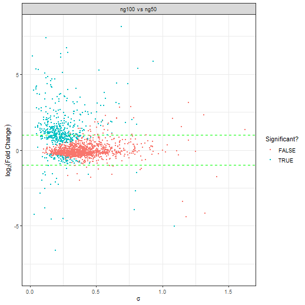
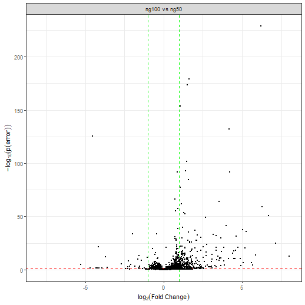
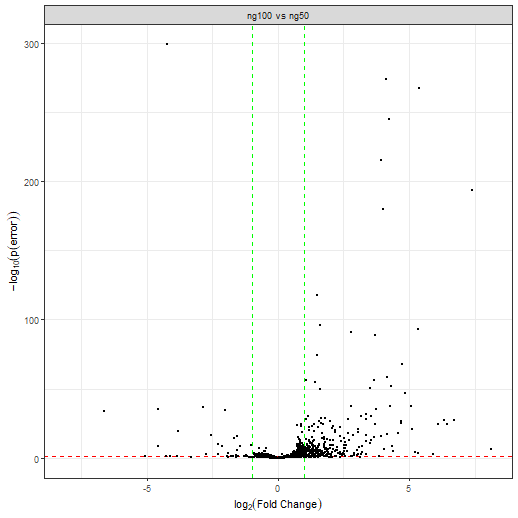

# 1. Setup
This tutorial is quite fast and on a very simple data set (2 conditions only), for a more complicated tutorial for setup please see `vignette('baldur_ups_tutorial')`.
First we load `baldur` and setup the model dependent variables we need, then normalize the data and add the mean-variance trends.

```r
library(baldur)
# Setup design matrix
yeast_design <- model.matrix(~0+factor(rep(1:2, each = 3)))
colnames(yeast_design) <- paste0('ng', c(50, 100))
# Compare the first and second column of the design matrix
# with the following contrast matrix
yeast_contrast <- matrix(c(-1, 1), nrow = 1)

# Since baldur itself does not deal with missing data we remove the
# rows that have missing data for the purpose of the tutorial.
# Else, one would replace the filtering step with imputation but that is outside
# the scope of baldur
yeast_norm <- yeast %>%
  # Remove missing data
  tidyr::drop_na() %>%
  # Normalize data (this might already have been done if imputation was performed)
  psrn('identifier') %>%
  # Add mean-variance trends
  calculate_mean_sd_trends(yeast_design)
```
Importantly, note that the column names of the design matrix are unique subsets of the names of the columns within the conditions:

```r
colnames(yeast)
#> [1] "identifier" "ng50_1"     "ng50_2"     "ng50_3"     "ng100_1"    "ng100_2"    "ng100_3"
colnames(yeast_design)
#> [1] "ng50"  "ng100"
```
This is essential for `baldur` to know which columns to use in calculations and to perform transformations.

# 2. Trend-partitioning and uncertainty estimation
Next is to infer the mixture of the data and to estimate the parameters needed for `baldur`.
First we will setup the needed variables for using `baldur` without partitioning the data.
Then, partitioning and setting up `baldur` after trend-partitioning

```r
# Fit the gamma regression
gr_model <- fit_gamma_regression(yeast_norm, sd ~ mean)
# Estimate the uncertainty
unc_gr <- estimate_uncertainty(gr_model, yeast_norm, 'identifier', yeast_design)
```

# 3. Run the sampling procedure
Finally we sample the posterior of each row in the data.
First we sample assuming a single trend, then using the partitioning.

```r
# Single trend
gr_results <- gr_model %>%
  # Add hyper-priors for sigma
  estimate_gamma_hyperparameters(yeast_norm) %>%
  infer_data_and_descision_model(
    'identifier',
    yeast_design,
    yeast_contrast,
    unc_gr,
    clusters = 10 # I highly recommend using parallel workers/clusters
  )               # this will greatly reduce the speed of running baldur
# The top hits then looks as follows:
gr_results %>%
  dplyr::arrange(err)
#> # A tibble: 1,802 × 21
#>    identifier   compa…¹       err    lfc lfc_025 lfc_50 lfc_975 lfc_eff lfc_r…²  sigma sigma…³ sigma…⁴ sigma…⁵ sigma…⁶
#>    <chr>        <chr>       <dbl>  <dbl>   <dbl>  <dbl>   <dbl>   <dbl>   <dbl>  <dbl>   <dbl>   <dbl>   <dbl>   <dbl>
#>  1 Cre09.g4060… ng100 … 1.08e-206  6.18    5.75   6.18    6.57    2249.   1.00  0.155   0.0838  0.141   0.305    1190.
#>  2 sp|P37302|A… ng100 … 5.00e-175  1.51    1.40   1.51    1.62    2777.   1.00  0.0569  0.0308  0.0517  0.113    1230.
#>  3 Cre12.g5541… ng100 … 4.94e-168  1.61    1.49   1.61    1.72    3299.   1.00  0.0607  0.0333  0.0558  0.114    1272.
#>  4 sp|P38788|S… ng100 … 5.09e-145  1.07    0.995  1.07    1.16    3084.   1.00  0.0441  0.0241  0.0402  0.0877    903.
#>  5 Cre10.g4207… ng100 … 3.85e-127  4.16    3.82   4.16    4.50    3448.   1.00  0.185   0.103   0.172   0.350    1453.
#>  6 Cre14.g6167… ng100 … 9.61e-125 -4.54   -4.91  -4.55   -4.17    2250.   1.00  0.175   0.0974  0.160   0.346    1190.
#>  7 Cre12.g5331… ng100 … 2.08e-101  1.41    1.29   1.41    1.55    3271.   1.00  0.0701  0.0382  0.0649  0.133    1382.
#>  8 Cre06.g3065… ng100 … 9.19e- 99  4.20    3.80   4.20    4.59    2652.   0.999 0.182   0.100   0.167   0.351    1243.
#>  9 sp|P09624|D… ng100 … 1.32e- 96  1.47    1.33   1.48    1.61    2774.   1.00  0.0729  0.0390  0.0663  0.150    1177.
#> 10 sp|P19882|H… ng100 … 2.92e- 86  0.883   0.794  0.883   0.978   3648.   0.999 0.0511  0.0279  0.0464  0.104    1164.
#> # … with 1,792 more rows, 7 more variables: sigma_rhat <dbl>, lp <dbl>, lp_025 <dbl>, lp_50 <dbl>, lp_975 <dbl>,
#> #   lp_eff <dbl>, lp_rhat <dbl>, and abbreviated variable names ¹​comparison, ²​lfc_rhat, ³​sigma_025, ⁴​sigma_50,
#> #   ⁵​sigma_975, ⁶​sigma_eff
```
Here `err` is the probability of error, i.e., the two tail-density supporting the null-hypothesis, `lfc` is the estimated log$_2$-fold change, `sigma` is the common variance, and `lp` is the log-posterior.
Columns without suffix shows the mean estimate from the posterior, while the suffixes `_025`, `_50`, and `_975`, are the 2.5, 50.0, and 97.5, percentiles, respectively.
The suffixes `_eff` and `_rhat` are the diagnostic variables returned by `rstan` (please see the Stan manual for details).
In general, a larger `_eff` indicates a better sampling efficiency, and `_rhat` compares the mixing within chains against between the chains and should be smaller than 1.05.

# 4. Running Baldur with Latent Gamma Regression estimation
First we fit the LGMR model:

```r
yeast_lgmr <- fit_lgmr(yeast_norm, lgmr_model, cores = 5)
```

We can print the model with `print` and extract parameters of interest with `coef`:

```r
print(yeast_lgmr)
#> 
#> LGMR Model
#> 	mu=exp(-1.797977 - 0.3228215 f(bar_y)) + kappa exp(7.062297 - 0.3840176 f(bar_y))
#> 
#>  auxiliary:
#>         mean   se_mean      sd   2.5%    25%    50%    75%  97.5%  n_eff  Rhat
#> alpha  4.091  0.004272  0.2317  3.649  3.932  4.086  4.245   4.56   2941     1
#> nrmse  0.562  0.000223  0.0139  0.535  0.552  0.562  0.571   0.59   3904     1
#> 
#> 
#>  Coefficients:
#>        mean   se_mean      sd    2.5%     25%     50%     75%   97.5%  n_eff  Rhat
#> I    -1.798  0.000432  0.0260  -1.848  -1.816  -1.798  -1.781  -1.746   3619     1
#> I_L   7.062  0.000469  0.0421   6.981   7.034   7.062   7.090   7.146   8064     1
#> S     0.323  0.000269  0.0234   0.278   0.307   0.323   0.338   0.370   7520     1
#> S_L   0.384  0.000294  0.0348   0.316   0.361   0.384   0.408   0.452  13971     1
#> 
#> 
#>  theta:
#>               mean   se_mean      sd      2.5%     25%    50%    75%  97.5%  n_eff  Rhat
#> theta[1]     0.247  1.28e-03  0.2201  0.000596  0.0515  0.188  0.407  0.727  29628     1
#> theta[2]     0.700  2.47e-03  0.2497  0.021652  0.6283  0.771  0.867  0.993  10193     1
#> theta[3]     0.295  1.42e-03  0.2467  0.000713  0.0668  0.244  0.493  0.796  30039     1
#> theta[4]     0.349  1.69e-03  0.2720  0.000827  0.0871  0.319  0.574  0.871  25763     1
#> theta[5]     0.899  6.12e-04  0.0887  0.702494  0.8497  0.916  0.971  1.000  21017     1
#> theta[6]     0.297  1.44e-03  0.2483  0.000842  0.0670  0.245  0.496  0.799  29849     1
#> theta[7]     0.354  1.73e-03  0.2726  0.000891  0.0943  0.326  0.581  0.877  24679     1
#> theta[8]     0.972  1.88e-04  0.0320  0.886171  0.9588  0.984  0.996  1.000  28967     1
#> theta[9]     0.346  1.65e-03  0.2682  0.001007  0.0922  0.315  0.567  0.869  26430     1
#> theta[10]    0.234  1.24e-03  0.2107  0.000484  0.0462  0.178  0.384  0.703  28940     1
#> theta[11]    0.244  1.24e-03  0.2161  0.000446  0.0506  0.190  0.399  0.717  30261     1
#> theta[12]    0.711  2.21e-03  0.2440  0.027332  0.6447  0.780  0.874  0.993  12211     1
#> theta[13]    0.410  2.00e-03  0.2864  0.001431  0.1302  0.421  0.659  0.904  20543     1
#> theta[14]    0.844  1.14e-03  0.1422  0.499549  0.7861  0.869  0.942  0.999  15563     1
#> theta[15]    0.807  1.44e-03  0.1763  0.251709  0.7464  0.842  0.927  0.999  15063     1
#> theta[16]    0.303  1.45e-03  0.2502  0.000786  0.0713  0.255  0.498  0.815  29733     1
#> theta[17]    0.496  2.33e-03  0.2998  0.002715  0.2150  0.555  0.746  0.962  16532     1
#> theta[18]    0.335  1.60e-03  0.2678  0.001009  0.0815  0.294  0.557  0.860  27874     1
#> theta[19]    0.287  1.40e-03  0.2472  0.000637  0.0602  0.230  0.477  0.802  31267     1
#> theta[20]    0.489  2.26e-03  0.3001  0.002199  0.2096  0.543  0.738  0.970  17638     1
#> theta[21]    0.468  2.29e-03  0.2954  0.002074  0.1872  0.514  0.718  0.947  16704     1
#> theta[22]    0.350  1.81e-03  0.2714  0.000867  0.0900  0.323  0.578  0.871  22606     1
#> theta[23]    0.899  6.21e-04  0.0902  0.694670  0.8484  0.917  0.971  1.000  21145     1
#> theta[24]    0.980  1.33e-04  0.0240  0.913767  0.9709  0.989  0.997  1.000  32651     1
#> theta[25]    0.289  1.38e-03  0.2452  0.000680  0.0639  0.236  0.482  0.799  31658     1
#> theta[26]    0.295  1.47e-03  0.2476  0.000746  0.0658  0.245  0.489  0.804  28173     1
#> theta[27]    0.331  1.69e-03  0.2665  0.000789  0.0781  0.292  0.548  0.856  24995     1
#> theta[28]    0.535  2.40e-03  0.2971  0.003133  0.2889  0.609  0.773  0.976  15304     1
#> theta[29]    0.368  1.82e-03  0.2774  0.000956  0.1011  0.349  0.605  0.884  23265     1
#> theta[30]    0.237  1.19e-03  0.2131  0.000493  0.0474  0.181  0.385  0.709  31817     1
#> theta[31]    0.299  1.49e-03  0.2515  0.000648  0.0649  0.246  0.500  0.809  28406     1
#> theta[32]    0.266  1.33e-03  0.2326  0.000481  0.0552  0.212  0.437  0.763  30651     1
#> theta[33]    0.273  1.36e-03  0.2375  0.000577  0.0565  0.219  0.455  0.771  30656     1
#> theta[34]    0.297  1.46e-03  0.2492  0.000645  0.0659  0.247  0.494  0.808  29237     1
#> theta[35]    0.221  1.12e-03  0.2055  0.000454  0.0410  0.164  0.357  0.689  33467     1
#> theta[36]    0.323  1.56e-03  0.2625  0.000928  0.0780  0.278  0.537  0.853  28256     1
#> theta[37]    0.327  1.61e-03  0.2625  0.000938  0.0773  0.289  0.539  0.846  26720     1
#> theta[38]    0.790  1.80e-03  0.1917  0.128415  0.7364  0.830  0.912  0.998  11388     1
#> theta[39]    0.949  3.33e-04  0.0510  0.822175  0.9205  0.964  0.990  1.000  23458     1
#> theta[40]    0.674  2.29e-03  0.2596  0.016006  0.5746  0.745  0.857  0.994  12882     1
#> theta[41]    0.253  1.25e-03  0.2282  0.000449  0.0478  0.195  0.413  0.762  33525     1
#> theta[42]    0.497  2.18e-03  0.2956  0.002463  0.2306  0.552  0.739  0.968  18339     1
#> theta[43]    0.656  2.41e-03  0.2681  0.012231  0.5487  0.733  0.846  0.991  12405     1
#> theta[44]    0.250  1.28e-03  0.2227  0.000426  0.0504  0.194  0.409  0.740  30261     1
#> theta[45]    0.723  2.29e-03  0.2343  0.030274  0.6608  0.784  0.875  0.994  10513     1
#> theta[46]    0.217  1.14e-03  0.1993  0.000382  0.0403  0.161  0.352  0.669  30363     1
#> theta[47]    0.263  1.27e-03  0.2293  0.000614  0.0554  0.209  0.432  0.759  32370     1
#> theta[48]    0.457  2.23e-03  0.2966  0.001655  0.1708  0.500  0.705  0.949  17758     1
#> theta[49]    0.987  9.12e-05  0.0166  0.940662  0.9812  0.993  0.998  1.000  33259     1
#> theta[50]    0.227  1.12e-03  0.2076  0.000405  0.0441  0.170  0.372  0.695  34226     1
#> theta[51]    0.220  1.18e-03  0.2004  0.000447  0.0430  0.166  0.360  0.671  29036     1
#> theta[52]    0.222  1.14e-03  0.2029  0.000415  0.0435  0.168  0.359  0.684  31530     1
#> theta[53]    0.297  1.46e-03  0.2528  0.000638  0.0630  0.242  0.491  0.829  29955     1
#> theta[54]    0.257  1.27e-03  0.2251  0.000668  0.0553  0.202  0.424  0.747  31283     1
#> theta[55]    0.227  1.18e-03  0.2068  0.000434  0.0442  0.172  0.370  0.695  30791     1
#> theta[56]    0.267  1.31e-03  0.2328  0.000566  0.0555  0.211  0.439  0.764  31553     1
#> theta[57]    0.605  2.68e-03  0.2855  0.005704  0.4376  0.697  0.817  0.980  11369     1
#> theta[58]    0.921  4.82e-04  0.0719  0.748272  0.8798  0.938  0.980  1.000  22287     1
#> theta[59]    0.233  1.19e-03  0.2110  0.000393  0.0462  0.178  0.380  0.704  31411     1
#> theta[60]    0.774  1.81e-03  0.2035  0.096326  0.7124  0.820  0.908  0.997  12659     1
#> theta[61]    0.491  2.49e-03  0.2961  0.002815  0.2134  0.555  0.740  0.948  14140     1
#> theta[62]    0.334  1.63e-03  0.2681  0.000762  0.0784  0.295  0.560  0.852  26944     1
#> theta[63]    0.431  2.09e-03  0.2947  0.001488  0.1414  0.452  0.682  0.941  19862     1
#> theta[64]    0.928  4.40e-04  0.0654  0.771674  0.8886  0.944  0.983  1.000  22098     1
#> theta[65]    0.585  2.28e-03  0.2876  0.005597  0.3938  0.662  0.806  0.985  15870     1
#> theta[66]    0.307  1.51e-03  0.2507  0.000790  0.0731  0.263  0.509  0.806  27584     1
#> theta[67]    0.831  1.48e-03  0.1559  0.371649  0.7768  0.860  0.934  0.999  11170     1
#> theta[68]    0.388  2.02e-03  0.2845  0.000859  0.1092  0.380  0.634  0.898  19798     1
#> theta[69]    0.372  1.76e-03  0.2823  0.001137  0.0990  0.350  0.608  0.901  25732     1
#> theta[70]    0.535  2.48e-03  0.2944  0.003845  0.2894  0.616  0.773  0.966  14113     1
#> theta[71]    0.237  1.19e-03  0.2124  0.000484  0.0474  0.183  0.384  0.709  31935     1
#> theta[72]    0.952  2.99e-04  0.0490  0.828424  0.9265  0.968  0.992  1.000  26774     1
#> theta[73]    0.396  1.98e-03  0.2847  0.000840  0.1217  0.391  0.640  0.911  20619     1
#> theta[74]    0.244  1.19e-03  0.2173  0.000453  0.0494  0.187  0.401  0.723  33329     1
#> theta[75]    0.374  1.88e-03  0.2803  0.000987  0.1005  0.357  0.616  0.890  22337     1
#> theta[76]    0.906  5.71e-04  0.0822  0.722709  0.8581  0.922  0.972  1.000  20723     1
#> theta[77]    0.321  1.57e-03  0.2617  0.000716  0.0763  0.277  0.536  0.838  27618     1
#> theta[78]    0.265  1.33e-03  0.2334  0.000416  0.0536  0.209  0.437  0.767  30602     1
#> theta[79]    0.332  1.58e-03  0.2631  0.000876  0.0830  0.293  0.550  0.840  27582     1
#> theta[80]    0.981  1.26e-04  0.0222  0.920361  0.9732  0.990  0.998  1.000  31020     1
#> theta[81]    0.221  1.12e-03  0.2036  0.000341  0.0432  0.164  0.359  0.684  33015     1
#> theta[82]    0.268  1.34e-03  0.2345  0.000511  0.0556  0.211  0.440  0.769  30615     1
#> theta[83]    0.278  1.39e-03  0.2406  0.000637  0.0594  0.223  0.458  0.792  29971     1
#> theta[84]    0.966  2.25e-04  0.0370  0.867573  0.9480  0.979  0.995  1.000  27033     1
#> theta[85]    0.238  1.17e-03  0.2111  0.000523  0.0489  0.186  0.390  0.705  32464     1
#> theta[86]    0.268  1.34e-03  0.2362  0.000562  0.0543  0.210  0.441  0.779  30852     1
#> theta[87]    0.978  1.48e-04  0.0258  0.908861  0.9683  0.988  0.997  1.000  30338     1
#> theta[88]    0.256  1.29e-03  0.2261  0.000430  0.0537  0.200  0.421  0.749  30638     1
#> theta[89]    0.250  1.23e-03  0.2211  0.000589  0.0521  0.195  0.410  0.736  32377     1
#> theta[90]    0.321  1.58e-03  0.2642  0.000649  0.0732  0.276  0.534  0.854  27879     1
#> theta[91]    0.602  2.80e-03  0.2857  0.006320  0.4271  0.690  0.818  0.983  10436     1
#> theta[92]    0.420  2.14e-03  0.2914  0.001864  0.1337  0.434  0.671  0.917  18483     1
#> theta[93]    0.281  1.39e-03  0.2386  0.000604  0.0608  0.231  0.465  0.778  29568     1
#> theta[94]    0.969  1.96e-04  0.0349  0.876202  0.9537  0.982  0.996  1.000  31648     1
#> theta[95]    0.975  1.62e-04  0.0291  0.896208  0.9630  0.986  0.997  1.000  32407     1
#> theta[96]    0.964  2.38e-04  0.0400  0.858870  0.9451  0.978  0.995  1.000  28248     1
#> theta[97]    0.250  1.27e-03  0.2205  0.000637  0.0525  0.195  0.412  0.729  30050     1
#> theta[98]    0.936  4.23e-04  0.0613  0.786267  0.9023  0.953  0.987  1.000  20941     1
#> theta[99]    0.406  2.05e-03  0.2872  0.001157  0.1253  0.415  0.654  0.906  19702     1
#> theta[100]   0.979  1.36e-04  0.0245  0.911878  0.9699  0.988  0.997  1.000  32237     1
#>  [ reached getOption("max.print") -- omitted 1702 rows ]
# Extract the regression, alpha, and theta parameters and the NRMSE.
yeast_lgmr_coef <- coef(yeast_lgmr, pars = c("all"))
```

We can then estimate the uncertainty similar to the GR case:

```r
unc_lgmr <- estimate_uncertainty(yeast_lgmr, yeast_norm, 'identifier', yeast_design)
```

Then running the data and decision model:

```r
# Single trend
lgmr_results <- yeast_lgmr %>%
  # Add hyper-priors for sigma
  estimate_gamma_hyperparameters(yeast_norm) %>%
  infer_data_and_descision_model(
    'identifier',
    yeast_design,
    yeast_contrast,
    unc_lgmr,
    clusters = 10
  )
```

# 5. Visualization of the results
`baldur` have two ways of visualizing the results 1) plotting sigma vs LFC and 2) Volcano plots.
To plot sigma against LFC we use `plot_sa`:

```r
gr_results %>%
  plot_sa(
    alpha = .05, # Level of significance
    lfc = 1      # Add LFC lines
  )

lgmr_results %>%
  plot_sa(
    alpha = .05, # Level of significance
    lfc = 1      # Add LFC lines
  )
```



While it is hard to see with this few examples, in general a good decision is indicated by a lack of a trend between $\sigma$ and LFC.
To make a volcano plot one uses `plot_volcano` in a similar fashion to `plot_sa`:

```r
gr_results %>%
  plot_volcano(
    alpha = .05, # Level of significance
    lfc = 1      # Add LFC lines
  )

lgmr_results %>%
  plot_volcano(
    alpha = .05, # Level of significance
    lfc = 1      # Add LFC lines
  )
```


