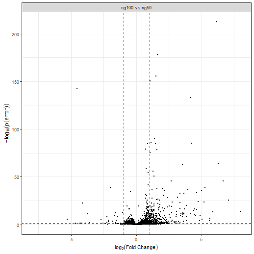

# 1. Setup
This tutorial is quite fast and on a very simple data set (2 conditions only), for a more complicated tutorial on the setup please see `vignette('baldur_ups_tutorial')`.
First we load `baldur` and setup the model dependent variables we need, then normalize the data and add the mean-variance trends.

```r
library(baldur)
# Setup design matrix
yeast_design <- model.matrix(~0+factor(rep(1:2, each = 3)))
colnames(yeast_design) <- paste0('ng', c(50, 100))
# Compare the first and second column of the design matrix
# with the following contrast matrix
yeast_contrast <- matrix(c(-1, 1), nrow = 2)

# Set id column
id_col <- colnames(yeast)[1] # "identifier"

# Since baldur itself does not deal with missing data we remove the
# rows that have missing values for the purpose of the tutorial.
# Else, one would replace the filtering step with imputation but that is outside
# the scope of baldur
yeast_norm <- yeast %>%
  # Remove missing data
  tidyr::drop_na() %>%
  # Normalize data (this might already have been done if imputation was performed)
  psrn(id_col) %>%
  # Add mean-variance trends
  calculate_mean_sd_trends(yeast_design)
```
Importantly, note that the column names of the design matrix are unique subsets of the names of the columns within the conditions:

```r
colnames(yeast)
#> [1] "identifier" "ng50_1"     "ng50_2"     "ng50_3"     "ng100_1"    "ng100_2"    "ng100_3"
colnames(yeast_design)
#> [1] "ng50"  "ng100"
```
This is essential for `baldur` to know which columns to use in calculations and to perform transformations.

# 2. Mean-Variance trends and Gamma Regression fitting
Next is to infer the mixture of the data and to estimate the parameters needed for `baldur`.
First we will setup the needed variables for using `baldur` without partitioning the data.
Then, partitioning and setting up `baldur` after trend-partitioning

```r
# Fit the gamma regression
gr_model <- fit_gamma_regression(yeast_norm, sd ~ mean)
# Estimate the uncertainty
unc_gr <- estimate_uncertainty(gr_model, yeast_norm, id_col, yeast_design)
```

# 3. Run the sampling procedure
Finally we sample the posterior of each row in the data.
First we sample assuming a single trend, then using the partitioning.

```r
# Single trend
gr_results <- gr_model %>%
  # Add hyper-priors for sigma
  estimate_gamma_hyperparameters(yeast_norm) %>%
  infer_data_and_decision_model(
    id_col,
    yeast_design,
    yeast_contrast,
    unc_gr,
    clusters = 10 # I highly recommend using parallel workers/clusters
  )               # this will greatly reduce the speed of running baldur
# The top hits then looks as follows:
gr_results %>%
  dplyr::arrange(err)
#> # A tibble: 1,802 × 22
#>    identifier         comparison       err   lfc lfc_025 lfc_50 lfc_975 lfc_eff lfc_rhat  sigma sigma_025 sigma_50 sigma_975 sigma_eff
#>    <chr>              <chr>          <dbl> <dbl>   <dbl>  <dbl>   <dbl>   <dbl>    <dbl>  <dbl>     <dbl>    <dbl>     <dbl>     <dbl>
#>  1 Cre09.g406050.t1.… ng100 vs … 7.63e-224  6.18   5.79    6.18    6.59   2079.     1.00 0.124     0.0676   0.114     0.243      1372.
#>  2 sp|P37302|APE3_YE… ng100 vs … 3.08e-184  1.51   1.41    1.51    1.61   3731.     1.00 0.0450    0.0245   0.0415    0.0869     1403.
#>  3 Cre12.g554100.t1.… ng100 vs … 1.88e-176  1.61   1.49    1.61    1.72   3203.     1.00 0.0493    0.0265   0.0451    0.0987     1072.
#>  4 sp|P38788|SSZ1_YE… ng100 vs … 5.72e-151  1.07   0.991   1.07    1.15   3696.     1.00 0.0357    0.0192   0.0324    0.0721     1154.
#>  5 Cre14.g616700.t1.… ng100 vs … 4.83e-118 -4.55  -4.96   -4.55   -4.14   2574.     1.00 0.148     0.0799   0.134     0.297       893.
#>  6 Cre10.g420750.t1.… ng100 vs … 7.84e-113  4.16   3.80    4.16    4.52   3056.     1.00 0.153     0.0847   0.140     0.305      1290.
#>  7 Cre06.g306550.t1.… ng100 vs … 4.38e-102  4.20   3.82    4.20    4.60   2972.     1.00 0.148     0.0816   0.137     0.287      1445.
#>  8 Cre12.g533100.t1.… ng100 vs … 9.87e- 98  1.41   1.29    1.41    1.55   3087.     1.00 0.0593    0.0325   0.0539    0.119      1232.
#>  9 sp|P09624|DLDH_YE… ng100 vs … 1.49e- 97  1.48   1.34    1.48    1.62   3135.     1.00 0.0592    0.0326   0.0539    0.119      1422.
#> 10 sp|P32481|IF2G_YE… ng100 vs … 1.38e- 90  1.59   1.43    1.59    1.74   3145.     1.00 0.0680    0.0370   0.0624    0.135      1500.
#> # ℹ 1,792 more rows
#> # ℹ 8 more variables: sigma_rhat <dbl>, lp <dbl>, lp_025 <dbl>, lp_50 <dbl>, lp_975 <dbl>, lp_eff <dbl>, lp_rhat <dbl>,
#> #   warnings <list>
```
Here `err` is the probability of error, i.e., the two tail-density supporting the null-hypothesis, `lfc` is the estimated log$_2$-fold change, `sigma` is the common variance, and `lp` is the log-posterior.
Columns without suffix shows the mean estimate from the posterior, while the suffixes `_025`, `_50`, and `_975`, are the 2.5, 50.0, and 97.5, percentiles, respectively.
The suffixes `_eff` and `_rhat` are the diagnostic variables returned by `rstan` (please see the Stan manual for details).
In general, a larger `_eff` indicates a better sampling efficiency, and `_rhat` compares the mixing within chains against between the chains and should be smaller than 1.05.

# 4. Running Baldur with Latent Gamma Mixture Regression estimation
First we fit the LGMR model:

```r
yeast_lgmr <- fit_lgmr(yeast_norm, id_col, lgmr_model, cores = 5)
```

We can print the model with `print` and extract parameters of interest with `coef`:

```r
print(yeast_lgmr, pars = c("coef", "aux"))
#> 
#> LGMR Model
#> 	μ = exp(-1.848 - 0.326 f(ȳ)) + κ exp(θ(7.521 - 0.474 f(ȳ)))
#> 
#>  Auxiliary:
#>       mean   se_mean     sd   2.5%    25%    50%    75%  97.5%  n_eff  Rhat
#> α     4.48  0.007271  0.299  3.912  4.283  4.477  4.680  5.093   1689     1
#> RMSE  0.52  0.000389  0.025  0.475  0.503  0.518  0.536  0.573   4123     1
#> 
#> 
#>  Coefficients:
#>         mean   se_mean      sd    2.5%     25%     50%     75%   97.5%  n_eff  Rhat
#> γ_0    7.521  0.000729  0.0505   7.424   7.487   7.521   7.555   7.622   4795     1
#> γ_0L  -1.848  0.000699  0.0299  -1.905  -1.868  -1.848  -1.828  -1.788   1828     1
#> γ_ȳ    0.326  0.000362  0.0246   0.279   0.309   0.325   0.342   0.374   4606     1
#> γ_ȳL   0.474  0.000546  0.0442   0.387   0.444   0.474   0.504   0.561   6562     1
# Extract the regression, alpha, and theta parameters and the NRMSE.
yeast_lgmr_coef <- coef(yeast_lgmr, pars = "all")
```
Baldur allows for two ways to plot the LGMR model, `plot_lgmr_regression`, and `plot_regression_field`.
The first plots lines of three cases of $\theta$, `0`, `0.5`, and `1`, and colors each peptide according to their infered $\theta$.
They can be plotted accordingly:

```r
plot_lgmr_regression(yeast_lgmr)
plot_regression_field(yeast_lgmr, rng = 25)
```


We can then estimate the uncertainty similar to the GR case:

```r
unc_lgmr <- estimate_uncertainty(yeast_lgmr, yeast_norm, id_col, yeast_design)
```

Then running the data and decision model:

```r
# Single trend
lgmr_results <- yeast_lgmr %>%
  # Add hyper-priors for sigma
  estimate_gamma_hyperparameters(yeast_norm, id_col) %>%
  infer_data_and_decision_model(
    id_col,
    yeast_design,
    yeast_contrast,
    unc_lgmr,
    clusters = 10
  )
```

# 5. Visualization of the results
`baldur` have two ways of visualizing the results 1) plotting sigma vs LFC and 2) Volcano plots.
To plot sigma against LFC we use `plot_sa`:

```r
gr_results %>%
  plot_sa(
    alpha = .05, # Level of significance
    lfc = 1      # Add LFC lines
  )

lgmr_results %>%
  plot_sa(
    alpha = .05, # Level of significance
    lfc = 1      # Add LFC lines
  )
```


While it is hard to see with this few examples, in general a good decision is indicated by a lack of a trend between $\sigma$ and LFC.
To make a volcano plot one uses `plot_volcano` in a similar fashion to `plot_sa`:

```r
gr_results %>%
  plot_volcano(
    alpha = .05, # Level of significance
    lfc = 1      # Add LFC lines
  )

lgmr_results %>%
  plot_volcano(
    alpha = .05, # Level of significance
    lfc = 1      # Add LFC lines
  )
```


