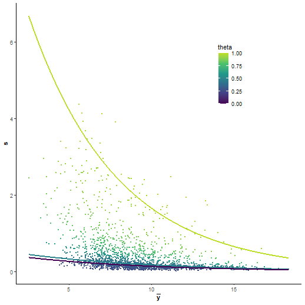

# 1. Setup
This tutorial is quite fast and on a very simple data set (2 conditions only), for a more complicated tutorial on the setup please see `vignette('baldur_ups_tutorial')`.
First we load `baldur` and setup the model dependent variables we need, then normalize the data and add the mean-variance trends.

```r
library(baldur)
# Setup design matrix
yeast_design <- model.matrix(~0+factor(rep(1:2, each = 3)))
colnames(yeast_design) <- paste0('ng', c(50, 100))
# Compare the first and second column of the design matrix
# with the following contrast matrix
yeast_contrast <- matrix(c(-1, 1), nrow = 2)

# Set id column
id_col <- colnames(yeast)[1] # "identifier"

# Since baldur itself does not deal with missing data we remove the
# rows that have missing values for the purpose of the tutorial.
# Else, one would replace the filtering step with imputation but that is outside
# the scope of baldur
yeast_norm <- yeast %>%
  # Remove missing data
  tidyr::drop_na() %>%
  # Normalize data (this might already have been done if imputation was performed)
  psrn(id_col) %>%
  # Add mean-variance trends
  calculate_mean_sd_trends(yeast_design)
```
Importantly, note that the column names of the design matrix are unique subsets of the names of the columns within the conditions:

```r
colnames(yeast)
#> [1] "identifier" "ng50_1"     "ng50_2"     "ng50_3"     "ng100_1"    "ng100_2"    "ng100_3"
colnames(yeast_design)
#> [1] "ng50"  "ng100"
```
This is essential for `baldur` to know which columns to use in calculations and to perform transformations.

# 2. Mean-Variance trends and Gamma Regression fitting
Next is to infer the mixture of the data and to estimate the parameters needed for `baldur`.
First we will setup the needed variables for using `baldur` without partitioning the data.
Then, partitioning and setting up `baldur` after trend-partitioning

```r
# Fit the gamma regression
gr_model <- fit_gamma_regression(yeast_norm, sd ~ mean)
# Estimate the uncertainty
unc_gr <- estimate_uncertainty(gr_model, yeast_norm, id_col, yeast_design)
```

# 3. Run the sampling procedure
Finally we sample the posterior of each row in the data.
First we sample assuming a single trend, then using the partitioning.

```r
# Single trend
gr_results <- gr_model %>%
  # Add hyper-priors for sigma
  estimate_gamma_hyperparameters(yeast_norm) %>%
  infer_data_and_decision_model(
    id_col,
    yeast_design,
    yeast_contrast,
    unc_gr,
    clusters = 10 # I highly recommend using parallel workers/clusters
  )               # this will greatly reduce the speed of running baldur
# The top hits then looks as follows:
gr_results %>%
  dplyr::arrange(err)
#> # A tibble: 1,802 × 22
#>    identifier                             comparison       err   lfc lfc_025 lfc_50 lfc_975 lfc_eff lfc_rhat  sigma sigma_025 sigma_50 sigma_975 sigma_eff sigma_rhat    lp lp_025 lp_50 lp_975 lp_eff lp_rhat warnings
#>    <chr>                                  <chr>          <dbl> <dbl>   <dbl>  <dbl>   <dbl>   <dbl>    <dbl>  <dbl>     <dbl>    <dbl>     <dbl>     <dbl>      <dbl> <dbl>  <dbl> <dbl>  <dbl>  <dbl>   <dbl> <list>  
#>  1 Cre09.g406050.t1.2|PACid:30781126|--2… ng100 vs … 2.93e-209  6.19   5.77   1.00     6.19    6.60    2382. 0.126     0.0666     1.00    0.113     0.266        944.  14.4   7.03  1.00   15.0   18.4    776. <chr>   
#>  2 sp|P37302|APE3_YEAST--187              ng100 vs … 1.32e-188  1.51   1.41   1.00     1.51    1.62    3228. 0.0456    0.0247     1.00    0.0416    0.0905      1437.  29.8  23.3   1.00   30.3   33.8   1084. <chr>   
#>  3 Cre12.g554100.t1.1|PACid:30791753|--87 ng100 vs … 2.10e-175  1.61   1.50   1.00     1.61    1.72    3235. 0.0494    0.0264     1.00    0.0447    0.0967      1338.  28.8  21.9   1.00   29.3   32.8    979. <chr>   
#>  4 sp|P38788|SSZ1_YEAST--86               ng100 vs … 1.69e-145  1.07   0.991  1.00     1.07    1.15    3187. 0.0355    0.0193     1.00    0.0326    0.0689      1324.  32.5  26.1   1.00   32.9   36.5   1041. <chr>   
#>  5 Cre10.g420750.t1.2|PACid:30790763|--5… ng100 vs … 1.32e-133  4.16   3.81   0.999    4.16    4.50    3202. 0.151     0.0832     1.00    0.140     0.289       1633.  17.5  11.3   1.00   18.0   21.3   1104. <chr>   
#>  6 Cre14.g616700.t1.1|PACid:30776509|--7… ng100 vs … 3.37e-127 -4.54  -4.91   1.00    -4.54   -4.15    2868. 0.145     0.0783     1.00    0.133     0.287       1108.  15.4   8.72  1.00   15.9   19.3    902. <chr>   
#>  7 sp|P09624|DLDH_YEAST--65-70            ng100 vs … 1.47e-100  1.47   1.33   1.00     1.47    1.61    2363. 0.0595    0.0321     1.00    0.0538    0.120       1381.  26.0  18.8   1.00   26.5   30.1   1007. <chr>   
#>  8 Cre12.g533100.t1.1|PACid:30792932|--1… ng100 vs … 4.02e- 94  1.41   1.28   1.00     1.41    1.56    3107. 0.0590    0.0318     1.00    0.0536    0.119       1135.  26.8  19.6   1.01   27.3   30.8    829. <chr>   
#>  9 Cre06.g306550.t1.1|PACid:30779423|--99 ng100 vs … 5.64e- 93  4.20   3.79   1.00     4.21    4.61    2448. 0.150     0.0799     1.00    0.137     0.308        944.  13.9   6.85  1.00   14.4   17.9    792. <chr>   
#> 10 sp|P32481|IF2G_YEAST--492              ng100 vs … 9.60e- 82  1.59   1.43   1.00     1.59    1.76    2451. 0.0689    0.0383     1.00    0.0627    0.138       1077.  24.5  17.8   1.00   25.1   28.5    837. <chr>   
#> # ℹ 1,792 more rows
```
Here `err` is the probability of error, i.e., the two tail-density supporting the null-hypothesis, `lfc` is the estimated log$_2$-fold change, `sigma` is the common variance, and `lp` is the log-posterior.
Columns without suffix shows the mean estimate from the posterior, while the suffixes `_025`, `_50`, and `_975`, are the 2.5, 50.0, and 97.5, percentiles, respectively.
The suffixes `_eff` and `_rhat` are the diagnostic variables returned by `rstan` (please see the Stan manual for details).
In general, a larger `_eff` indicates a better sampling efficiency, and `_rhat` compares the mixing within chains against between the chains and should be smaller than 1.05.

# 4. Running Baldur with Latent Gamma Mixture Regression estimation
First we fit the LGMR model:

```r
yeast_lgmr <- fit_lgmr(yeast_norm, id_col, lgmr_model, cores = 5)
#> Warning: There were 1 divergent transitions after warmup. See
#> https://mc-stan.org/misc/warnings.html#divergent-transitions-after-warmup
#> to find out why this is a problem and how to eliminate them.
#> Warning: Examine the pairs() plot to diagnose sampling problems
```

We can print the model with `print` and extract parameters of interest with `coef`:

```r
print(yeast_lgmr, pars = c("coef", "aux"))
#> 
#> LGMR Model
#> 	mu=exp(-1.798372 - 0.3227383 f(bar_y)) + kappa exp(7.062331 - 0.3843407 f(bar_y))
#> 
#>  Auxiliary:
#>         mean   se_mean     sd   2.5%    25%    50%    75%  97.5%  n_eff  Rhat
#> alpha  4.092  0.004408  0.235  3.649  3.930  4.086  4.248  4.569   2837     1
#> nrmse  0.562  0.000237  0.014  0.534  0.552  0.562  0.571  0.589   3474     1
#> 
#> 
#>  Coefficients:
#>        mean   se_mean      sd    2.5%     25%     50%     75%   97.5%  n_eff  Rhat
#> I    -1.798  0.000434  0.0262  -1.848  -1.816  -1.799  -1.781  -1.746   3643     1
#> I_L   7.062  0.000472  0.0417   6.981   7.034   7.062   7.090   7.144   7812     1
#> S     0.323  0.000270  0.0234   0.277   0.307   0.323   0.338   0.369   7526     1
#> S_L   0.384  0.000278  0.0349   0.314   0.361   0.385   0.408   0.452  15823     1
# Extract the regression, alpha, and theta parameters and the NRMSE.
yeast_lgmr_coef <- coef(yeast_lgmr, pars = "all")
```
Baldur allows for two ways to plot the LGMR model, `plot_lgmr_regression`, and `plot_regression_field`.
The first plots lines of three cases of $\theta$, `0`, `0.5`, and `1`, and colors each peptide according to their infered $\theta$.
They can be plotted accordingly:

```r
plot_lgmr_regression(yeast_lgmr)
plot_regression_field(yeast_lgmr, rng = 25)
```



We can then estimate the uncertainty similar to the GR case:

```r
unc_lgmr <- estimate_uncertainty(yeast_lgmr, yeast_norm, id_col, yeast_design)
```

Then running the data and decision model:

```r
# Single trend
lgmr_results <- yeast_lgmr %>%
  # Add hyper-priors for sigma
  estimate_gamma_hyperparameters(yeast_norm, id_col) %>%
  infer_data_and_decision_model(
    id_col,
    yeast_design,
    yeast_contrast,
    unc_lgmr,
    clusters = 10
  )
```

# 5. Visualization of the results
`baldur` have two ways of visualizing the results 1) plotting sigma vs LFC and 2) Volcano plots.
To plot sigma against LFC we use `plot_sa`:

```r
gr_results %>%
  plot_sa(
    alpha = .05, # Level of significance
    lfc = 1      # Add LFC lines
  )

lgmr_results %>%
  plot_sa(
    alpha = .05, # Level of significance
    lfc = 1      # Add LFC lines
  )
```


While it is hard to see with this few examples, in general a good decision is indicated by a lack of a trend between $\sigma$ and LFC.
To make a volcano plot one uses `plot_volcano` in a similar fashion to `plot_sa`:

```r
gr_results %>%
  plot_volcano(
    alpha = .05, # Level of significance
    lfc = 1      # Add LFC lines
  )

lgmr_results %>%
  plot_volcano(
    alpha = .05, # Level of significance
    lfc = 1      # Add LFC lines
  )
```


