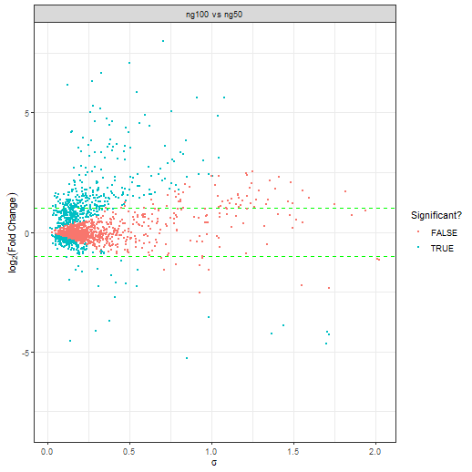
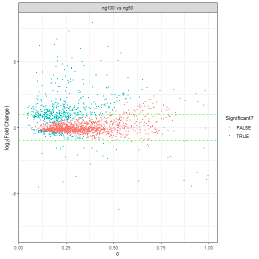

# 1. Setup
This tutorial is quite fast and on a very simple data set (2 conditions only), for a more complicated tutorial on the setup please see `vignette('baldur_ups_tutorial')`.
First we load `baldur` and setup the model dependent variables we need, then normalize the data and add the mean-variance trends.

```r
library(baldur)
# Setup design matrix
yeast_design <- model.matrix(~0+factor(rep(1:2, each = 3)))
colnames(yeast_design) <- paste0('ng', c(50, 100))
# Compare the first and second column of the design matrix
# with the following contrast matrix
yeast_contrast <- matrix(c(-1, 1), nrow = 2)

# Set id column
id_col <- colnames(yeast)[1] # "identifier"

# Since baldur itself does not deal with missing data we remove the
# rows that have missing values for the purpose of the tutorial.
# Else, one would replace the filtering step with imputation but that is outside
# the scope of baldur
yeast_norm <- yeast %>%
  # Remove missing data
  tidyr::drop_na() %>%
  # Normalize data (this might already have been done if imputation was performed)
  psrn(id_col) %>%
  # Add mean-variance trends
  calculate_mean_sd_trends(yeast_design)
```
Importantly, note that the column names of the design matrix are unique subsets of the names of the columns within the conditions:

```r
colnames(yeast)
#> [1] "identifier" "ng50_1"     "ng50_2"     "ng50_3"     "ng100_1"    "ng100_2"    "ng100_3"
colnames(yeast_design)
#> [1] "ng50"  "ng100"
```
This is essential for `baldur` to know which columns to use in calculations and to perform transformations.

# 2. Mean-Variance trends and Gamma Regression fitting
Next is to infer the mixture of the data and to estimate the parameters needed for `baldur`.
First we will setup the needed variables for using `baldur` without partitioning the data.
Then, partitioning and setting up `baldur` after trend-partitioning

```r
# Fit the gamma regression
gr_model <- fit_gamma_regression(yeast_norm, sd ~ mean)
# Estimate the uncertainty
unc_gr <- estimate_uncertainty(gr_model, yeast_norm, id_col, yeast_design)
```

# 3. Run the sampling procedure
Finally we sample the posterior of each row in the data.
First we sample assuming a single trend, then using the partitioning.

```r
# Single trend
gr_results <- gr_model %>%
  # Add hyper-priors for sigma
  estimate_gamma_hyperparameters(yeast_norm) %>%
  infer_data_and_decision_model(
    id_col,
    yeast_design,
    yeast_contrast,
    unc_gr,
    clusters = 10 # I highly recommend using parallel workers/clusters
  )               # this will greatly reduce the speed of running baldur
# The top hits then looks as follows:
gr_results %>%
  dplyr::arrange(err)
#> # A tibble: 1,802 × 22
#>    identifier comparison       err   lfc lfc_025 lfc_50 lfc_975 lfc_eff lfc_rhat  sigma sigma_025 sigma_50 sigma_975 sigma_eff
#>    <chr>      <chr>          <dbl> <dbl>   <dbl>  <dbl>   <dbl>   <dbl>    <dbl>  <dbl>     <dbl>    <dbl>     <dbl>     <dbl>
#>  1 Cre09.g40… ng100 vs … 4.74e-201  6.19   5.79    6.18    6.63   2557.    0.999 0.154     0.0819   0.139     0.315       960.
#>  2 sp|P37302… ng100 vs … 1.32e-197  1.51   1.41    1.51    1.62   3634.    1.00  0.0556    0.0306   0.0510    0.108      1300.
#>  3 Cre12.g55… ng100 vs … 2.03e-183  1.61   1.50    1.61    1.73   3370.    1.00  0.0601    0.0326   0.0549    0.117      1320.
#>  4 sp|P38788… ng100 vs … 2.62e-135  1.07   0.992   1.07    1.16   3215.    1.00  0.0439    0.0235   0.0398    0.0876      998.
#>  5 Cre14.g61… ng100 vs … 3.88e-133 -4.54  -4.90   -4.54   -4.16   2030.    1.00  0.176     0.0937   0.162     0.345      1352.
#>  6 Cre10.g42… ng100 vs … 9.63e-132  4.16   3.82    4.16    4.51   3568.    1.00  0.182     0.102    0.170     0.341      1608.
#>  7 sp|P09624… ng100 vs … 2.62e-108  1.48   1.34    1.48    1.61   3449.    1.00  0.0709    0.0394   0.0651    0.136      1382.
#>  8 Cre12.g53… ng100 vs … 2.08e-102  1.41   1.28    1.41    1.54   3175.    1.00  0.0703    0.0386   0.0647    0.133      1115.
#>  9 Cre06.g30… ng100 vs … 3.82e- 97  4.21   3.81    4.20    4.62   3210.    1.00  0.184     0.0987   0.168     0.370      1213.
#> 10 sp|P00358… ng100 vs … 2.44e- 79  1.06   0.944   1.06    1.17   3338.    1.00  0.0638    0.0344   0.0584    0.127      1263.
#> # ℹ 1,792 more rows
#> # ℹ 8 more variables: sigma_rhat <dbl>, lp <dbl>, lp_025 <dbl>, lp_50 <dbl>, lp_975 <dbl>, lp_eff <dbl>, lp_rhat <dbl>,
#> #   warnings <list>
```
Here `err` is the probability of error, i.e., the two tail-density supporting the null-hypothesis, `lfc` is the estimated log$_2$-fold change, `sigma` is the common variance, and `lp` is the log-posterior.
Columns without suffix shows the mean estimate from the posterior, while the suffixes `_025`, `_50`, and `_975`, are the 2.5, 50.0, and 97.5, percentiles, respectively.
The suffixes `_eff` and `_rhat` are the diagnostic variables returned by `rstan` (please see the Stan manual for details).
In general, a larger `_eff` indicates a better sampling efficiency, and `_rhat` compares the mixing within chains against between the chains and should be smaller than 1.05.

# 4. Running Baldur with Latent Gamma Mixture Regression estimation
First we fit the LGMR model:

```r
yeast_lgmr <- fit_lgmr(yeast_norm, id_col, lgmr_model, cores = 5)
```

We can print the model with `print` and extract parameters of interest with `coef`:

```r
print(yeast_lgmr, pars = c("coef", "aux"))
#> 
#> LGMR Model
#> 	mu=exp(-1.798403 - 0.3226009 f(bar_y)) + kappa exp(7.062802 - 0.3842484 f(bar_y))
#> 
#>  Auxiliary:
#>         mean   se_mean      sd   2.5%    25%    50%    75%  97.5%  n_eff  Rhat
#> alpha  4.096  0.004234  0.2315  3.662  3.935  4.088  4.248  4.565   2990     1
#> nrmse  0.561  0.000224  0.0139  0.534  0.552  0.561  0.571  0.589   3833     1
#> 
#> 
#>  Coefficients:
#>        mean   se_mean      sd    2.5%     25%     50%     75%   97.5%  n_eff  Rhat
#> I    -1.798  0.000426  0.0258  -1.848  -1.816  -1.799  -1.781  -1.747   3658     1
#> I_L   7.063  0.000463  0.0412   6.983   7.035   7.063   7.090   7.145   7918     1
#> S     0.323  0.000256  0.0233   0.278   0.307   0.322   0.338   0.369   8289     1
#> S_L   0.384  0.000271  0.0346   0.316   0.361   0.384   0.407   0.452  16282     1
# Extract the regression, alpha, and theta parameters and the NRMSE.
yeast_lgmr_coef <- coef(yeast_lgmr, pars = "all")
```
Baldur allows for two ways to plot the LGMR model, `plot_lgmr_regression`, and `plot_regression_field`.
The first plots lines of three cases of $\theta$, `0`, `0.5`, and `1`, and colors each peptide according to their infered $\theta$.
They can be plotted accordingly:

```r
plot_lgmr_regression(yeast_lgmr)
plot_regression_field(yeast_lgmr, rng = 25)
```


We can then estimate the uncertainty similar to the GR case:

```r
unc_lgmr <- estimate_uncertainty(yeast_lgmr, yeast_norm, id_col, yeast_design)
```

Then running the data and decision model:

```r
# Single trend
lgmr_results <- yeast_lgmr %>%
  # Add hyper-priors for sigma
  estimate_gamma_hyperparameters(yeast_norm, id_col) %>%
  infer_data_and_decision_model(
    id_col,
    yeast_design,
    yeast_contrast,
    unc_lgmr,
    clusters = 10
  )
```

# 5. Visualization of the results
`baldur` have two ways of visualizing the results 1) plotting sigma vs LFC and 2) Volcano plots.
To plot sigma against LFC we use `plot_sa`:

```r
gr_results %>%
  plot_sa(
    alpha = .05, # Level of significance
    lfc = 1      # Add LFC lines
  )

lgmr_results %>%
  plot_sa(
    alpha = .05, # Level of significance
    lfc = 1      # Add LFC lines
  )
```



While it is hard to see with this few examples, in general a good decision is indicated by a lack of a trend between $\sigma$ and LFC.
To make a volcano plot one uses `plot_volcano` in a similar fashion to `plot_sa`:

```r
gr_results %>%
  plot_volcano(
    alpha = .05, # Level of significance
    lfc = 1      # Add LFC lines
  )

lgmr_results %>%
  plot_volcano(
    alpha = .05, # Level of significance
    lfc = 1      # Add LFC lines
  )
```


