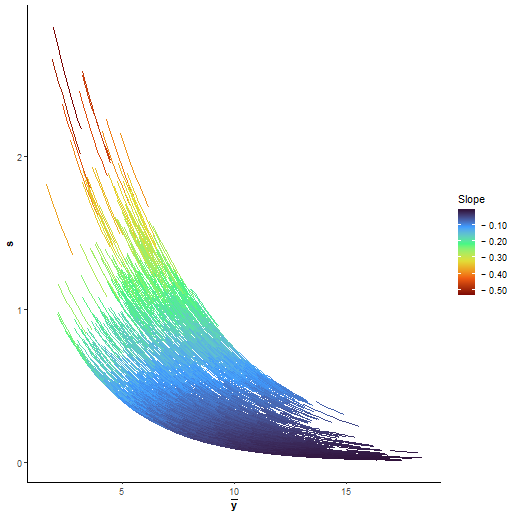
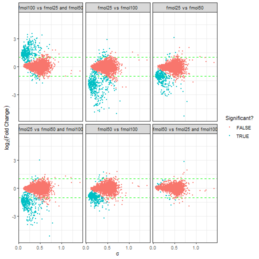
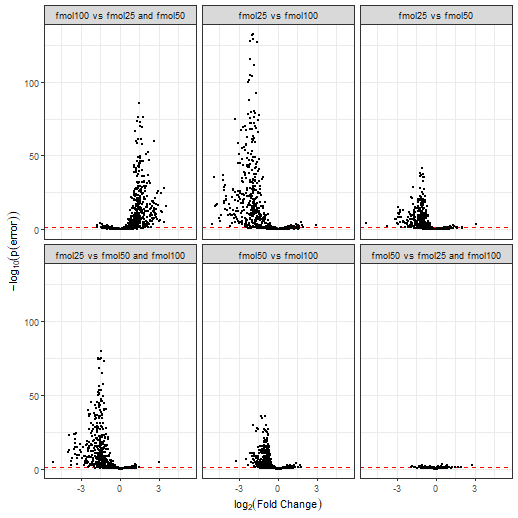

# 1. Setup
Here we cover the tutorial of `UPS-DS`.
The `UPS-DS` has one more condition than the `yeast-DS` and has one more replicate in each condition (`yeast-DS` is shown in `vignette("baldur_yeast_tutorial")`).

```r
library(baldur)
# Packages for pre-processing
library(dplyr, warn.conflicts = FALSE)
library(tidyr, warn.conflicts = FALSE)

# Define the number of parallel workers to use
workers <- floor(parallel::detectCores()/2)

# Setup the design matrix
ups_design <- model.matrix(~ 0 + factor(rep(1:3, each = 4)))
colnames(ups_design) <- paste0('fmol', c(25, 50, 100))

# Set id column
id_col <- colnames(ups)[1] # "identifier"

# Normalize and add M-V trend
ups_norm <- ups %>%
  # Remove rows with NA for the sake of the tutorial
  drop_na() %>%
  # Normalize the data
  psrn(id_col) %>%
  calculate_mean_sd_trends(ups_design)

# For the contrast, we want to compare all conditions against each other, and in addtion, suppose we would like to know the difference between the mean of condition 1 and 3 against 2 ([fmol25 + fmol100]/2 - fmol50).
# This can easily be achieved with the following:
ups_contrast <- matrix(
  c(
     1,  1,   0,  1,   -0.5, -0.5,
    -1,  0,   1, -0.5,  1,   -0.5,
     0, -1,  -1, -0.5, -0.5,  1
  ), nrow = ncol(ups_design),
  byrow = TRUE
)
rownames(ups_contrast) <- colnames(ups_design)
```
Lets go over the design and contrast matrix.
First, lets not how the design matrix uses subsets of the real columns of each condition:

```r
colnames(ups_norm[-1])
#>  [1] "fmol25_1"  "fmol25_2"  "fmol25_3"  "fmol25_4"  "fmol50_1"  "fmol50_2"  "fmol50_3"  "fmol50_4"  "fmol100_1" "fmol100_2" "fmol100_3" "fmol100_4" "mean"     
#> [14] "sd"
colnames(ups_design)
#> [1] "fmol25"  "fmol50"  "fmol100"
```
This lets `baldur` easily identify what columns that are of interest and setting up pre-cursors for the sampling.
In addition, `baldur` gets information on the number of conditions there are in the data (i.e., `ncol(ups_design)`) and the number of replicates in each condition (i.e., `colSums(ups_design)`).
Next, the contrast matrix:

```r
ups_contrast
#>         [,1] [,2] [,3] [,4] [,5] [,6]
#> fmol25     1    1    0  1.0 -0.5 -0.5
#> fmol50    -1    0    1 -0.5  1.0 -0.5
#> fmol100    0   -1   -1 -0.5 -0.5  1.0
```
First, note how the contrast only has two columns; currently `baldur` only allows pair-wise comparisons.
Lets go over the columns, the first column tells us that the first column of the design matrix should be compared against the second.
I.e., the column means `fmol25 - fmol50`.
The second column shows that the first column (in the design matrix) should be compared against the third, i.e., `fmol25 - fmol100`.
The third column shows that the second column should be compared against the third (`fmol50 - fmol100`).
The remaining columns shows comparisons between the mean of two conditions against one other condition.
I.e., column four shows `fmol25 - 0.5*(fmol50 - fmol100)`, and so on.

# 2. Mean-Variance trends and Gamma Regression fitting
First, I would like to note that reader that the remainder of the tutorial will look very similar to `vignette("baldur_yeast_tutorial")`.
The next step in `baldur` is to partition the trends in the mean and variance, and then to estimate the uncertainty of each measurement.

The trends before and after partitioning can then be visualized with `plot_gamma`:

```r
plot_gamma(ups_norm)
```


We can then estimate the uncertainty for the partitioned data as follows:

```r
# Fit the gamma regression
gr <- fit_gamma_regression(ups_norm)
# Get each data points uncertainty
unc_gr <- estimate_uncertainty(gr, ups_norm, id_col, ups_design)
```

# 3. Sampling from the Data and Decision model
Finally we sample the posterior of each row in the data.
`baludr` is very easy to run in parallel and this will drastically reduce the running time.
The only thing that needs to be changed is the `clusters` flag:

```r
# Single trend
gr_results <- gr %>%
  # Add hyper-priors for sigma
  estimate_gamma_hyperparameters(ups_norm, id_col) %>%
  infer_data_and_decision_model(
    id_col,
    ups_design,
    ups_contrast,
    unc_gr,
    clusters = workers # Change this to 1 to run sequentially
  )
```
Here `err` is the probability of error, i.e., the two tail-density supporting the null-hypothesis, `lfc` is the estimated log$_2$-fold change, `sigma` is the common variance, and `lp` is the log-posterior.
Columns without suffix shows the mean estimate from the posterior, while the suffixes `_025`, `_50`, and `_975`, are the 2.5, 50.0, and 97.5, percentiles, respectively.
The suffixes `_eff` and `_rhat` are the diagnostic variables returned by `rstan` (please see the Stan manual for details).
In general, a larger `_eff` indicates a better sampling efficiency, and `_rhat` compares the mixing within chains against between the chains and should be smaller than 1.05.
An important difference from `yeast-DS` is that each peptide gets three rows, one for each comparison in the contrast matrix.

# 4. Inference with Latent Gamma Mixuter Regression
To run Baldur with the LGMR model is very similar to running it with the GR model.
First we fit the regression model using the `fit_lgmr` function.
Here I will try to make use of my parallel processors to speed-up the inference:

```r
ups_lgmr <- fit_lgmr(ups_norm, id_col, chains = 10, cores = workers, warmup = 1000, iter = 3000)
```
On rare occasions, the UPS-DS will have a few (<10) divergent transitions or exceed maximum tree depth, it is unlikely to have any impact on the final inference (considering that the posterior draws are 20 000).
One could increase the acceptance rate and max tree depth at the expense of computational time.
E.g., with:

```r
ups_lgmr <- fit_lgmr(
  ups_norm, id_col, chains = 10, cores = workers, warmup = 1000, iter = 3000,
  control = list(adapt_delta = .95, max_treedepth = 11)
)
```
Plotting LGMR:

```r
plot_lgmr_regression(ups_lgmr)
plot_regression_field(ups_lgmr, rng = 25)
```


We can observe that the main density of the M-V trend is captured by the common trend while the sparser upper trend is captured by the latent trend.
This generally indicates a good fit of the model.

We can then estimate the uncertainties and hyperparameters for the data and decision model and run them as for the GR model:

```r
# Estimate uncertainty
unc_lgmr <- estimate_uncertainty(ups_lgmr, ups_norm, id_col, ups_design)
# Sample from the data and decision model
lgmr_results <- ups_lgmr %>%
  # Add hyper-priors for sigma
  estimate_gamma_hyperparameters(ups_norm, id_col) %>%
  infer_data_and_decision_model(
    id_col,
    ups_design,
    ups_contrast,
    unc_lgmr,
    clusters = workers # Change this to 1 to run sequentially
  )
```

# 5. Visualization of the results
`baldur` have two ways of visualizing the results 1) plotting sigma vs LFC and 2) Volcano plots.
To plot sigma against LFC we use `plot_sa`:

```r
gr_results %>%
  plot_sa(
    alpha = .05, # Level of significance
    lfc = 1      # Add LFC lines
  )

lgmr_results %>%
  plot_sa(
    alpha = .05, # Level of significance
    lfc = 1      # Add LFC lines
  )
```


In general, a good decision is indicated by a lack of a trend between $\sigma$ and LFC.
We can see that Baludr with the LGMR model (second plot) has a lower trend compared to GR model (first plot) for which there is a trend for $\sigma$ to increase with LFC.


To make a volcano plot one uses `plot_volcano` in a similar fashion to `plot_sa`:

```r
gr_results %>%
  plot_volcano(
    alpha = .05 # Level of significance
  )

lgmr_results %>%
  plot_volcano(
    alpha = .05 # Level of significance
  )
```


